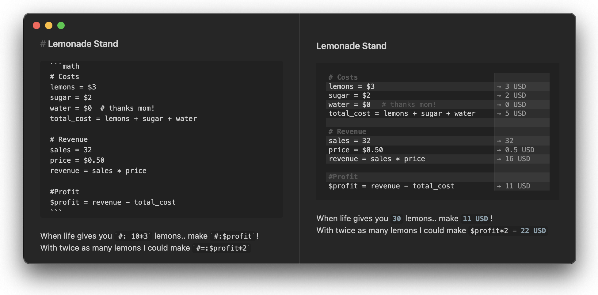

# Numerals


**Numerals turns Obsidian notes into living calculations.** Use math blocks or inline expressions to calculate with units, currencies, variables, functions, frontmatter, Dataview metadata, and values from other notes.



## At a Glance

| Feature | Example |
| --- | --- |
| Inline calculations | `` `#: 3ft * 4ft` `` -> `12 ft^2` |
| Show-your-work equations | `` `#=: 2 * (3ft + 4ft)` `` -> `2 * (3 ft + 4 ft) = 14 ft` |
| Full math blocks | <code>```math<br>20 mi / 4 hr to m/s<br>```</code> -> `2.235 m / s` |
| Units and conversions | `100 km/hr in mi/hr` -> `62.137 mi / hr` |
| Currency math | `$100/hr * 3 days` -> `7,200.00 USD` |
| Note-wide variables | `$rate = $150/hr`, then `` `#: $rate * 40hr` `` |
| Cross-note references | `[[Client Settings]].rates.hourly * 8hr` |
| Result insertion | `@[profit] = revenue - expenses` writes `@[profit::10.00 USD]` |

## Quick Start

Add a `math` code block anywhere in a note:

````markdown
```math
revenue = $2,400
expenses = $850
profit = revenue - expenses =>
```
````

Or calculate directly in a sentence:

```markdown
The project total is `#: $150/hr * 8hr`.
```

Use equation mode when the calculation itself is important:

```markdown
The room perimeter is `#=: 2 * (12ft + 10ft)`.
```

## Core Features

### Inline Calculations

Inline Numerals expressions are ordinary inline code with a trigger prefix:

| Syntax | Renders as | Best for |
| --- | --- | --- |
| `` `#: 3ft * 4ft` `` | `12 ft^2` | Showing just the answer |
| `` `#=: 3ft * 4ft` `` | `3 ft * 4 ft = 12 ft^2` | Showing the expression and answer |
| `` `#$: 3ft * 4ft` `` | 12 ft² typeset with MathJax | A TeX-rendered answer |
| `` `#$=: 3ft * 4ft` `` | 3 ft · 4 ft = 12 ft² typeset with MathJax | A TeX-rendered equation |

Inline calculations work in Live Preview and Reading mode. They support the same math engine, number formatting, units, currency symbols, variables, frontmatter, and Dataview values as math blocks.

The `#$:` and `#$=:` triggers render the result (and, in equation mode, the expression) as TeX-style MathJax, inline with surrounding text in both Live Preview and Reading mode. All four trigger prefixes are configurable in the Numerals settings.

### Math Blocks

Numerals math blocks are ideal for longer calculations:

````markdown
```math
# Lemonade stand
cups = 120
price = $1.50
revenue = cups * price
lemons = $18
sugar = $7
profit = revenue - lemons - sugar =>
```
````

Use `=>` to highlight important results. Lines without a highlighted result can be dimmed or hidden depending on your settings.

### Units, Currency, and Functions

Numerals uses [mathjs](https://mathjs.org/) for calculations and adds Obsidian-friendly preprocessing for currency symbols and readable number input.

| Type | Examples |
| --- | --- |
| Units | `1ft + 12in` -> `2 ft` |
| Conversions | `72 degF to degC` -> `22.222 degC` |
| Currency | `$1,000 * 2` -> `2,000.00 USD` |
| Rates | `$100/hr * 3 days` -> `7,200.00 USD` |
| Functions | `sqrt(144)`, `sin(pi/2)`, `log(1000, 10)` |
| Bases | `0xff + 0b100` -> `259` |
| Fractions | `fraction(1/3) + fraction(1/4)` -> `7/12` |

Recovery candidate input rules: use **ungrouped numbers inside function arguments, arrays, and indexes**. `max(1,234)` means two arguments and returns `234`; `[1,234]` has two elements. Use `max(1234, 5)` for one thousand two hundred thirty-four. Outside these contexts, complete grouped literals such as `1,234.50 + 2` are accepted, including inside ordinary grouping parentheses. This restriction also applies to parentheses nested in a call/list. Explicit currency amounts such as `max($1,234.50, $2)` remain single amounts. Malformed grouping such as `1,0001` is never partially stripped. Strings and `#` comments are preserved.

Cross-note properties retain their raw value and type: if `[[numbers]].value` is `-2`, `[[numbers]].value ^ 2` returns `4`. References support scalar values, complex numbers, units, BigNumbers, fractions, and matrices. They cannot be assignment targets or export functions/objects. Quoted metadata expressions can produce matrices; a raw metadata field array still uses its last entry, matching Dataview repeated-field behavior. These changes are recovery-candidate behavior; stable distribution remains 1.10.2.

Currency symbols can be customized in settings.

### Note-Wide Variables

Prefix a variable or function with `$` to make it available across the whole note:

````markdown
```math
$rate = $150/hr
$discount(x) = x * 0.9
```

Estimate: `#: $rate * 40hr`
Discounted: `#: $discount($rate * 40hr)`
````

Note-wide variables work across math blocks and inline expressions.

### Previous Results

Use `@prev` to refer to the previous result:

````markdown
```math
base = 100
base * 1.2
@prev * 1.08
```
````

Inline expressions can use `@prev` too:

```markdown
First year: `#: 100 * 1.2`
Second year: `#: @prev * 1.08`
```

### Totals

Use `@total` or `@sum` to add previous results up to the last blank line or heading/comment:

````markdown
```math
$12
$18
$25
@total =>
```
````

### Frontmatter and Dataview Metadata

Numerals can read selected note properties from frontmatter:

```markdown
---
numerals: [price, quantity]
price: 29.99
quantity: 150
---

`#=: price * quantity`
```

Use `numerals: all` to expose all frontmatter properties to Numerals. `$`-prefixed frontmatter values are automatically available as note-wide variables.

Dataview inline fields and metadata can also be used in calculations when Dataview is installed.

### Cross-Note References

Reference frontmatter and Dataview metadata from other notes with `[[note]].property`:

````markdown
```math
hours = 12 hr
subtotal = [[Client Settings]].rates.hourly * hours
tax = subtotal * [[Client Settings]].taxRate
total = subtotal + tax =>
```
````

Nested properties use dot notation:

```text
[[config]].rates.hourly
[[project/invoice]].lineItems.total
```

Cross-note references work in math blocks and inline expressions. When referenced metadata changes, Numerals rerenders dependent inline values.

### Result Insertion

Use `@[label]` to write a result back into the raw note as Dataview-style inline metadata:

````markdown
```math
@[profit] = $2,400 - $850
```
````

Numerals updates the source text to:

```markdown
@[profit::1550.00 USD]
```

### Auto-Complete

Auto-complete suggestions work in math blocks and inline Numerals expressions. Suggestions can include:

- Variables from the current block
- Note-wide `$` variables
- Frontmatter and Dataview metadata
- Cross-note properties after `[[note]].`
- mathjs functions and constants
- Greek letters by typing `:`, such as `:mu` -> `μ`

### Click to Edit in Live Preview

Rendered math blocks remain easy to edit. Click or tap a rendered Numerals line in Live Preview to focus the matching source line.

## Display Options

Numerals is designed to fit naturally with Obsidian themes and supports multiple render styles.

### Render Style

Choose a default render style in settings, or set it per block:

| Block language | Style |
| --- | --- |
| `math` | Uses your configured default |
| `math-plain` | Plain text |
| `math-tex` | TeX-style rendering |
| `math-highlight` | Syntax-highlighted input |


### Layouts

Choose how results appear next to calculations:

- **Two panes**: input and result in separate columns.
- **Answer to the right**: compact inline result display.
- **Answer below**: result appears on the next line.


### Number Formatting

Configure how rendered numbers are displayed:

- **System formatted**: follows your local system separators.
- **Fixed**: full precision with no thousands separator.
- **Exponential**: scientific notation.
- **Engineering**: exponent is a multiple of 3.
- **Formatted**: choose a specific thousands/decimal style.

Override formatting for one math block with display-only directives:

````markdown
```math
@format comma-period
@decimalPlaces 2
subtotal = 1234.5
third = 1 / 3
```
````

`@format` accepts `system`, `fixed`, `exponential` (or `scientific`), `engineering`, `comma-period`, `period-comma`, `space-comma`, and `indian`. `@decimalPlaces` accepts an integer from 0 through 20; `@decimalPlace` is also accepted.

These directives change displayed and inserted results, not values in calculation scope. For computational rounding, use mathjs directly: `round(value, 2)` for numbers or `round(amount, 2, GBP)` for currency Units.

### Currency Formatting

Currency results use **Currency standard** precision and **Currency code** display by default. Pure currency values therefore render with the conventional number of decimal places for their currency while keeping an unambiguous unit code.

Examples of the default precision are:

- GBP and USD use 2 places: `120.00 GBP`
- JPY uses 0 places: `120 JPY`
- KWD uses 3 places: `120.000 KWD`

A custom currency mapping uses the configured **Custom currency decimal places** value, from 0 through 20. This setting is enabled when currency-standard precision is selected.

Choose **Use rendered number format** when currency values should instead follow the general number-format behavior used by other Units.

Choose **Configured symbol** to display the symbol from Numerals' active currency mapping instead of its code. Symbol order, spacing, digits, and signs follow the selected locale, while the configured symbol itself is preserved. For example, a `$` mapping to CAD still uses `$`, rather than substituting `CA$`.

Currency presentation applies to pure currency results, including derived values such as `remaining / 8`. Compound rates such as `GBP / hour` retain the general number format and code. A block-level `@decimalPlaces` directive takes precedence over currency-standard digits.

Result insertion always writes the currency code, never a display symbol. For example, a result displayed as `£12.50` is inserted as `12.50 GBP`.

## Installation

Install **Numerals** from Obsidian's Community Plugins browser.

### Pre-Release Testing

To test upcoming releases before they reach the stable Obsidian directory:

1. Install the [BRAT plugin](https://github.com/TfTHacker/obsidian42-brat).
2. Run `Obsidian42 - BRAT: Add a beta plugin for testing`.
3. Enter `gtg922r/obsidian-numerals`.
4. Enable Numerals in Community Plugins.

## Development

Numerals is an Obsidian community plugin written in TypeScript and bundled with esbuild.

### Local Commands

```bash
npm install
npm run dev
npm test
npm run lint
npm run build
```

### Versioning

Update the version number in `package.json`:

```bash
npm run version:patch
npm run version:minor
npm run version:major
```

These commands only update `package.json`. Stable release metadata is updated by the production release script.

### Mathjs Symbol Suggestions

Auto-complete suggestions for mathjs functions and constants are kept as a static list in `src/mathjsUtilities.ts`.

When upgrading `mathjs`, run:

```bash
npm run symbols:check
```

If the check finds intentional changes, run:

```bash
npm run symbols:update
```

Review the generated diff and adjust explicit exclusions in `scripts/mathjs-symbols.ts` for documented symbols that should not appear in suggestions.

### Releases

Create a pre-release for BRAT users:

```bash
npm run release:beta
```

Promote a tested version to the stable Obsidian release channel:

```bash
npm run release
```

Production releases update `manifest.json` and `versions.json`, build the project, commit stable release metadata, and promote the matching GitHub release. GitHub Actions generates release assets from the tag, including a tag-matched `manifest.json`, and creates GitHub Artifact Attestations for uploaded files.

## Related

Other Obsidian calculation plugins may fit different workflows:

- [obsidian-calc](https://github.com/meld-cp/obsidian-calc) for calculator-style expression evaluation and result insertion.
- [obsidian-mathpad](https://github.com/Canna71/obsidian-mathpad) for a fuller computer algebra system inside Obsidian.

Numerals is also inspired by calculator-as-notes apps such as [Numi](https://numi.app/), [Numbr](https://numbr.dev/), and [Soulver](https://soulver.app/).
